# 實作計畫 - 現代化 Python LINE Bot 開發

## 目標說明
使用官方最新版本的 **LINE Messaging API SDK v3**（`line-bot-sdk>=3.0.0`），在 Python 環境中建立結構清晰、安全性高且易於擴充的 LINE 機器人專案。

本專案主要包含：
1. **安全 Webhook 回呼處理**：自動進行 `X-Line-Signature` HMAC-SHA256 數位簽章驗證。
2. **機密設定管理**：利用 `.env` 與 `.env.example` 管理金鑰，防止密鑰意外洩漏。
3. **模組化訊息路由**：預設提供基礎回音（Echo）與指令選單（如 `/help`、`/time`），並預留未來擴充 Google Gemini 或其他 AI 模型的介面。
4. **完整開發者工具**：包含健康檢查端點、自動化單元測試（pytest），以及 ngrok 本地通道與 LINE Developers Console 設定教學。

```mermaid
flowchart LR
    User["LINE 用戶"] <-->|"發送訊息 / 事件"| LinePlatform["LINE Messaging API 伺服器"]
    LinePlatform <-->|"HTTPS Webhook (POST /callback)"| Ngrok["公開反向代理 (ngrok / 雲端)"]
    Ngrok <-->|"HTTP (localhost:5000)"| WebServer["Flask 應用程式 (app.py)"]
    WebServer -->|"驗證數位簽章"| WebhookHandler["WebhookHandler (v3)"]
    WebhookHandler -->|"分發事件"| MessageRouter["訊息路由處理 (handlers)"]
    MessageRouter -->|"建立 ReplyMessageRequest"| MessagingApi["MessagingApi 客戶端"]
    MessagingApi -->|"回覆訊息"| LinePlatform
```



---

## 需使用者確認事項

> [!IMPORTANT]
> **LINE Developers 開發者帳號與金鑰準備**：
> 如需進行即時 LINE 聊天測試，需要準備：
> 1. [LINE Developers Console](https://developers.line.biz/) 開發者帳號。
> 2. 建立 Provider 與 **Messaging API Channel**，並取得：
>    - `LINE_CHANNEL_SECRET`（Channel 密鑰）
>    - `LINE_CHANNEL_ACCESS_TOKEN`（長期存取權杖 Channel Access Token）
> 3. 將公開 HTTPS 網址（例如透過 `ngrok` 取得的網址）填入 LINE 後台的 Webhook URL。

> [!NOTE]
> **網頁框架選擇**：
> 預設建議採用 **Flask**，因為其輕量、直觀且為 Python LINE Bot 最普遍的標準範例。如果您希望使用支援原生非同步（async/await）與型別定義的 **FastAPI**，也可以為您調整。

---

## 待確認問題 (Open Questions)

> [!IMPORTANT]
> 1. **機器人的核心功能需求**：
>    - **選項 A：回音與指令工具機器人**（預設基礎：自動複讀使用者訊息，並支援 `/help`、`/time`、`/ping` 等指令）。
>    - **選項 B：AI 智慧對話機器人**（串接 Google Gemini API，具備多輪自然語言對話與問答能力）。
>    - **選項 C：自訂業務邏輯**（例如特定關鍵字查詢、通知推播等）。
> 2. **框架偏好**：
>    - **Flask**（輕量、穩定、適合快速上手）。
>    - **FastAPI**（現代化、非同步高併發）。

---

## 預計變更與專案結構

在專案目錄 `c:\Users\hello-python` 中建立以下模組化架構：
- `.gitignore`：排除敏感資訊 `.env`、快取與虛擬環境。
- `requirements.txt`：套件依賴清單。
- `.env.example`：環境變數範本檔。
- `config.py`：集中管理環境設定與金鑰檢查。
- `app.py`：主程式（處理 Webhook 接收、簽章檢驗與健康檢查）。
- `handlers/message_handler.py`：訊息處理與指令路由模組。
- `tests/test_webhook.py`：單元測試（檢驗端點與簽章驗證）。
- `README.md`：繁體中文設定與本機測試指南。

---

### 設定與套件依賴

#### [NEW] requirements.txt
定義專案所需之套件：

```txt
line-bot-sdk>=3.14.0
flask>=3.0.0
python-dotenv>=1.0.0
pytest>=8.0.0
```

#### [NEW] .env.example
設定檔範本：

```env
LINE_CHANNEL_SECRET=請在此填入_channel_secret
LINE_CHANNEL_ACCESS_TOKEN=請在此填入_channel_access_token
PORT=5000
DEBUG=True
```

#### [NEW] .gitignore
防止金鑰與快取上傳至 Git：

```gitignore
.env
__pycache__/
*.py[cod]
*$py.class
.pytest_cache/
.venv/
venv/
```

#### [NEW] config.py
環境變數載入與驗證邏輯：

```python
import os
from dotenv import load_dotenv

load_dotenv()

LINE_CHANNEL_SECRET = os.getenv("LINE_CHANNEL_SECRET", "")
LINE_CHANNEL_ACCESS_TOKEN = os.getenv("LINE_CHANNEL_ACCESS_TOKEN", "")
PORT = int(os.getenv("PORT", "5000"))
DEBUG = os.getenv("DEBUG", "False").lower() in ("true", "1", "yes")

def validate_config():
    """檢查必要環境變數是否已設置"""
    missing = []
    if not LINE_CHANNEL_SECRET:
        missing.append("LINE_CHANNEL_SECRET")
    if not LINE_CHANNEL_ACCESS_TOKEN:
        missing.append("LINE_CHANNEL_ACCESS_TOKEN")
    return missing
```

---

### 應用程式核心與訊息分發

#### [NEW] handlers/message_handler.py
負責訊息邏輯與指令處理：

```python
from linebot.v3.messaging import (
    MessagingApi,
    ReplyMessageRequest,
    TextMessage
)
from linebot.v3.webhooks import MessageEvent
from datetime import datetime

def handle_text_message(event: MessageEvent, messaging_api: MessagingApi):
    """處理接收到的文字訊息並回傳"""
    user_text = event.message.text.strip()
    reply_token = event.reply_token

    # 指令處理
    if user_text.lower() == "/help":
        reply_content = (
            "🤖 **LINE Bot 指令列表**\n"
            "- `/help`：顯示此指令清單\n"
            "- `/time`：查看伺服器當前時間\n"
            "- `/ping`：測試機器人連線狀態\n"
            "- 其他文字：將會自動回音（Echo）"
        )
    elif user_text.lower() == "/time":
        now_str = datetime.now().strftime('%Y-%m-%d %H:%M:%S')
        reply_content = f"🕒 伺服器時間：{now_str}"
    elif user_text.lower() == "/ping":
        reply_content = "🏓 Pong！機器人運作正常。"
    else:
        # 預設回音行為
        reply_content = f"你說了：{user_text}"

    # 發送回覆訊息
    messaging_api.reply_message(
        ReplyMessageRequest(
            reply_token=reply_token,
            messages=[TextMessage(text=reply_content)]
        )
    )
```

#### [NEW] app.py
Flask 核心入口點：

```python
from flask import Flask, request, abort, jsonify
from linebot.v3 import WebhookHandler
from linebot.v3.exceptions import InvalidSignatureError
from linebot.v3.messaging import (
    Configuration,
    ApiClient,
    MessagingApi
)
from linebot.v3.webhooks import MessageEvent, TextMessageContent

import config
from handlers.message_handler import handle_text_message

app = Flask(__name__)

# LINE Bot SDK v3 設定
configuration = Configuration(access_token=config.LINE_CHANNEL_ACCESS_TOKEN)
handler = WebhookHandler(config.LINE_CHANNEL_SECRET)

@app.route("/", methods=["GET"])
def health_check():
    """健康檢查端點"""
    missing_keys = config.validate_config()
    status = "ready" if not missing_keys else "unconfigured"
    return jsonify({
        "status": status,
        "service": "line-bot-server",
        "missing_config": missing_keys
    }), 200

@app.route("/callback", methods=["POST"])
def callback():
    """LINE Webhook 回呼進入點"""
    signature = request.headers.get("X-Line-Signature", "")
    body = request.get_data(as_text=True)

    try:
        handler.handle(body, signature)
    except InvalidSignatureError:
        app.logger.warning("簽章驗證失敗 (Invalid Signature)。")
        abort(400)

    return "OK", 200

@handler.add(MessageEvent, message=TextMessageContent)
def on_message_event(event):
    """監聽文字訊息事件"""
    with ApiClient(configuration) as api_client:
        line_bot_api = MessagingApi(api_client)
        handle_text_message(event, line_bot_api)

if __name__ == "__main__":
    missing = config.validate_config()
    if missing:
        print(f"[警告] 尚未設定環境變數：{', '.join(missing)}")
        print("請在 .env 檔案中填寫金鑰以進行正式連線測試。")
    app.run(host="0.0.0.0", port=config.PORT, debug=config.DEBUG)
```

---

### 自動化測試

#### [NEW] tests/test_webhook.py
驗證端點狀態與數位簽章防護機制：

```python
import pytest
from app import app

@pytest.fixture
def client():
    app.config["TESTING"] = True
    with app.test_client() as client:
        yield client

def test_health_check(client):
    """測試健康檢查端點運作是否正常"""
    response = client.get("/")
    assert response.status_code == 200
    data = response.get_json()
    assert "status" in data
    assert data["service"] == "line-bot-server"

def test_callback_without_signature(client):
    """未附帶合法數位簽章時應回傳 400 Bad Request"""
    response = client.post("/callback", data="test_payload")
    assert response.status_code == 400
```

---

### 文件與使用指南

#### [NEW] README.md
包含繁體中文詳細教學：
1. 套件安裝方式（`pip install -r requirements.txt`）。
2. 在 LINE Developers Console 申請與取得 Channel Secret、Channel Access Token。
3. 使用 ngrok 建立本機 HTTPS 通道（`ngrok http 5000`）並填入 Webhook URL。
4. 關閉 LINE 官方預設自動回覆（Auto-reply messages）以避免雙重回覆。
5. 單元測試執行指令。

---

## 驗證計畫 (Verification Plan)

### 自動化測試
1. 安裝相依套件：
   ```powershell
   pip install -r requirements.txt
   ```
2. 執行 pytest 單元測試：
   ```powershell
   pytest tests/ -v
   ```
   **預期結果**：健康檢查端點測試與非法簽章拒絕測試皆通過（PASS）。

### 手動驗證
1. 啟動伺服器：
   ```powershell
   python app.py
   ```
2. 使用 PowerShell 或瀏覽器測試本機健康檢查：
   ```powershell
   Invoke-RestMethod -Uri "http://127.0.0.1:5000/"
   ```
   **預期結果**：回傳 JSON 格式之伺服器狀態。
3. 真實 LINE 聊天室測試（選用）：
   - 啟動 ngrok：`ngrok http 5000`
   - 在 LINE Developers Console 中填寫 Webhook URL (`https://<ngrok-id>.ngrok-free.app/callback`) 並點擊 **Verify**。
   - 在手機 LINE 中對機器人發送 `/help`、`/time` 或任意文字，確認機器人即時正確回應。
